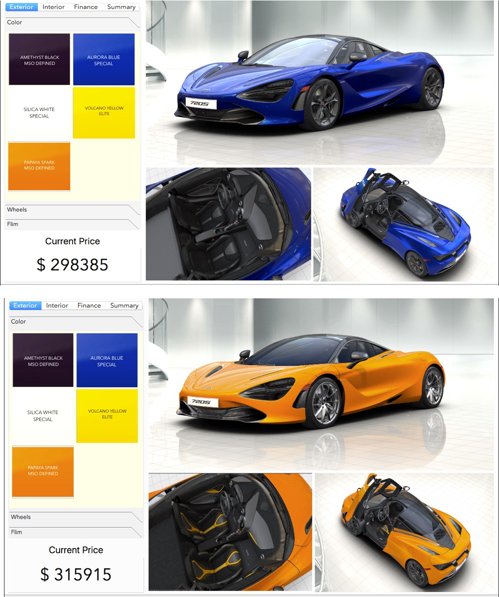
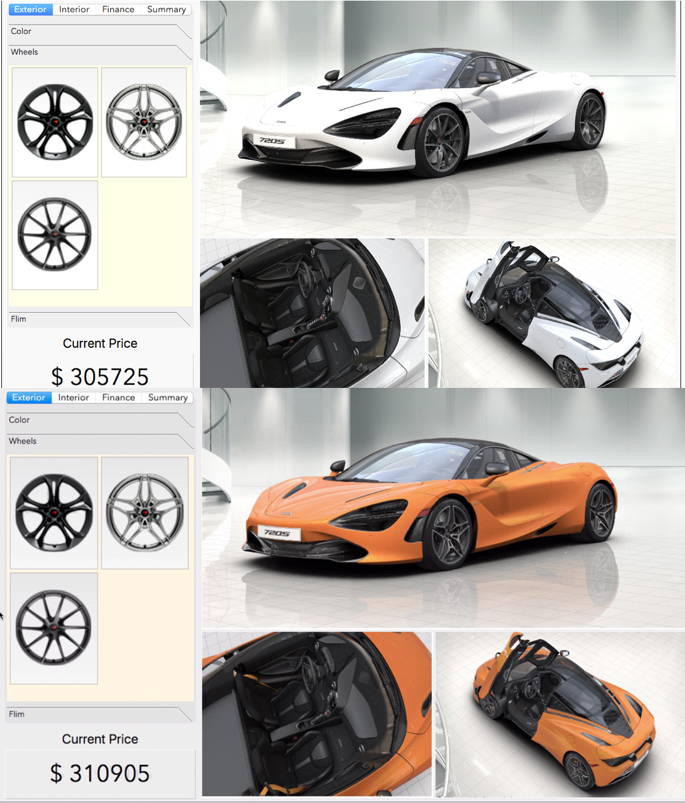
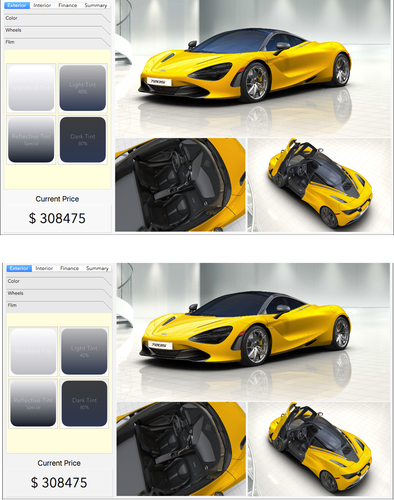
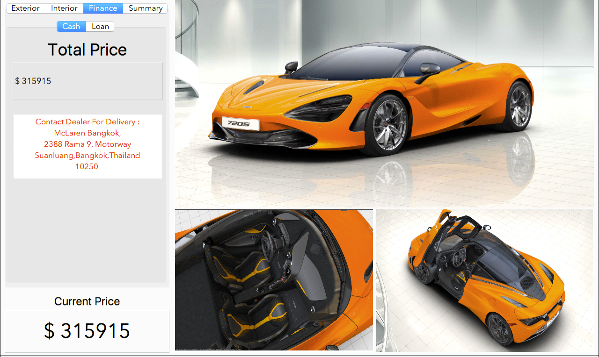
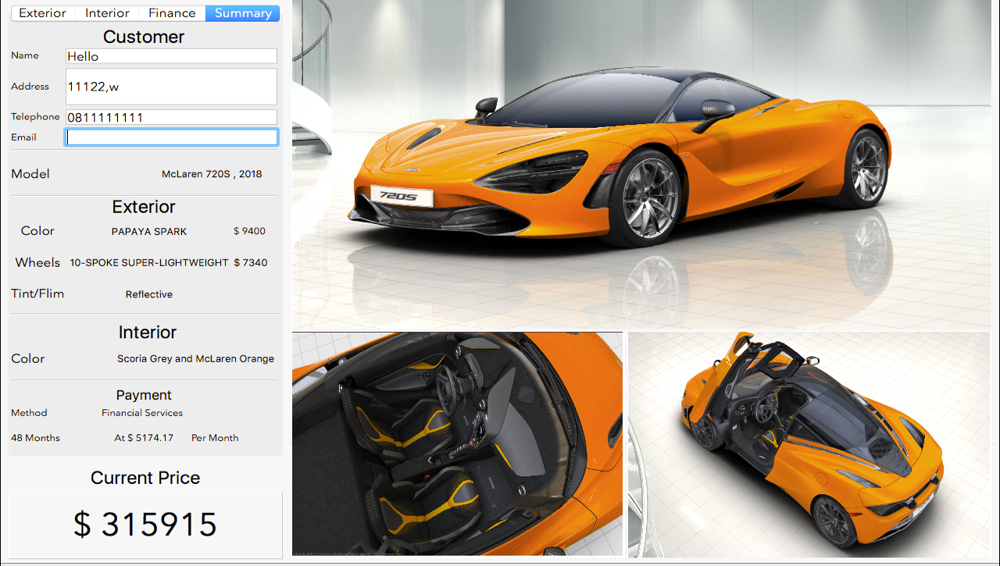
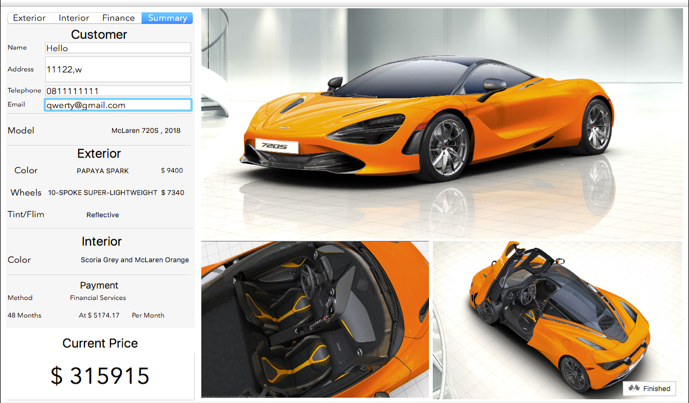
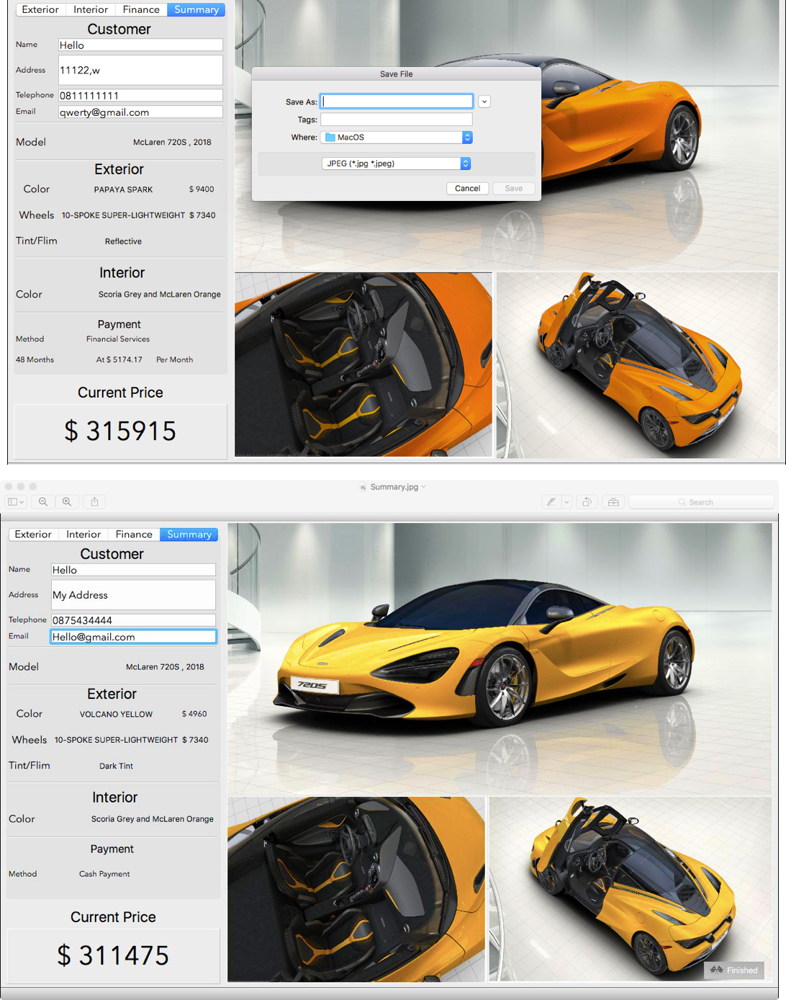
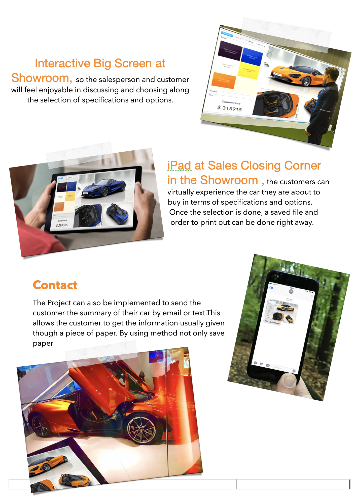

# Car Configurator
Learned knowledge from this oop class has massively built up my capability in developing this project. i have significantly gained insight into how business problems can be solved with oop. until recently, i visited the motorshow and found that salespeople had lost many customers, as they could not close the deal within reasonable time frame and aren’t able to complete the booking transactions fast enough. thus this project was initiated to automate the critical moment of the close-sales process. through the development process, i felt determined to make it happen, since this project was the product that combined both what i learned from throughout the course and my inspiration about automobile in which i think it was great to do it.

## Starting Screen / Color
At the start of the program, the aggregate interface is shown below. It is classified into right and left zones. The right zone is the function area, whereas the right zone is the car visual zone. The users will start with ‘exterior’ function by choosing color of their favorite. However, different color comes with different price, as the reflection of market reality. Then price box below will make price calculation accordingly.

## Wheels
After that, under the ‘exterior’ function, the users will further choose wheel of their favorite from three options. Similar to price, different wheel pattern has different price. After choosing, the price will be calculated accordingly.

## Window Tint
Further, under the exterior’ function, the users will choose ‘window tint’ of their favorite from four options with different darkness and quality. Different film option has different price. After choosing, the price will be calculated accordingly.

## Interior 
Further, under the ‘exterior’ function, the users will choose ‘interior’ of their favorite from four options with different combination of color tone. All options have similar price and quality. After choosing, the price will be calculated accordingly.

## Finance ( Cash )
Further, under the ‘finance’ function, the users will choose between ‘cash’ and ‘loan’. is cash option with final price at the bottom left corner.

## Finance ( Loan )
In case that the customer chooses ‘loan’ option. Further details will be shown as Down Payment Amount, Interest Rate, and Terms/Period of Payment. The application automatically updates each time any value is changed the result will be shown in the box below. They include Financial Value, Total Amount of to-be-paid Interest, Total Finance Due, and Monthly Payment.

## Summary
Next, under the ‘summary’ function, the customer will be asked to fill in name, address, telephone, and email. This page will also summarize the chosen specifications and options with payment and final price.

## Finish
After the customer finished filling the form correctly then the finish button will appear, this will allow the customer to save their configuration

## Saving
At the final stage, the salesperson can save the completed form which is ready to print out

## Project Application

